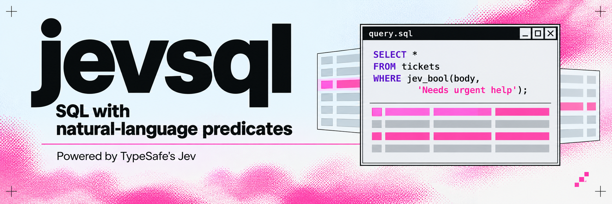

<p align="center">
  
</p>

# JevSQL

**Turn database rows into decisions you can query, inspect, refresh, and test.**

JevSQL adds TypeSafe Jev judgments to SQLite. It can compare records by meaning, select exact evidence from text, rank retrieved passages, route uncertain results to review, and detect when a changed source invalidates an earlier decision. It runs as a Node library or CLI with zero runtime dependencies.

| Problem | Working solution |
|---|---|
| An AI answer cites evidence that no longer supports its claim | Save an evidence audit, refresh it, and inspect the before/after decision history. |
| The same business appears under different names in two systems | Use SQL to narrow candidate pairs, then `jev_match` to estimate whether they refer to the same entity. |
| A generated contact address or amount contains invented characters | Find candidates in code, then use `jev_pick` to select an exact source span or return `NULL`. |
| A retrieved passage is related but does not answer the question | Rank permission-filtered passages with descriptive score levels. |
| Automation confidently guesses when evidence is missing | Use explicit unknown labels, abstention bands, and review queues. |
| Nobody knows which confidence threshold is useful | Evaluate labeled rows once and compare accuracy, coverage, and review workload across thresholds. |
| A database passes structural checks but contains unsupported decisions | Run semantic data checks in CI with explicit failure exit codes. |

## What breaks without it

```bash
node examples/contrast.mjs            # 31 comparisons, both sides executed
node examples/contrast.mjs --offline  # skip the seven that call the live API
```

Every row below was executed on both sides. The failing values are what the queries actually returned.

**Queries that run clean and return the wrong answer**

| | Ordinary tooling | JevSQL |
|---|---|---|
| Revenue joined to line items | returns **3750** (real revenue: 1250) | refuses to compile: the join can multiply rows |
| `UNIQUE` column joined under a different collation | foreign key exists, so **20** (the one order is 10) | refuses: uniqueness is `BINARY`, the join compares `NOCASE` |
| `v <> 'a'` rewritten as `v IS NOT 'a'` | review says "same predicate, negated" | differs on the **null values** fixture |
| A view replaced and a trigger added | table diff says **no change** | `view_changed`, `trigger_added` |

**Statements that should never have run**

| | Ordinary tooling | JevSQL |
|---|---|---|
| `WITH gone AS (DELETE …) SELECT …` | guard says **read-only, allowed** — 3 orders, 9 items gone | `delete`, destructive, no WHERE clause |
| Tenant id interpolated from the request | **1250** for `tenant-a' OR '1'='1'` | **350**, tenant from the authenticated actor |
| A tenant column called `account_id` | heuristic finds no `tenant_id`, returns **both tenants** | refuses to compile until it is classified |
| `SELECT id` where `people.id` is denied | name blocklist sees no `salary`, **allows it** | resolves the rowid read, `column_not_allowed` |
| A reviewed query replayed, or the actor swapped | signed token stays valid | permit is single-use and bound to actor, params, schema |

**Migrations, operations, and meaning**

| | Ordinary tooling | JevSQL |
|---|---|---|
| `up` then `down`, both exit 0 | **"rolled back successfully"**, 3 rows → 0 | rejected: schema restored, rows **not** |
| Migration vs. the schema in the PR description | approved | rejected: declared `country`, DDL adds `region` |
| TypeScript model vs. the live schema | `tsc` says **0 errors** | two block-level divergences that fail at runtime |
| A 12-row `Seq Scan` | "seq scan, add an index" | 0 symptoms; the *index scan* off by 980,000× is the incident |
| Three sessions waiting in a circle | kill the longest waiter (a victim) | `deadlock-cycle`, with the participants |
| A backup that succeeded | green tick | `verified-but-never-restored`, 0 restore drills |
| A replica reporting 0 ms lag | healthy | `telemetry-stale` — last value 15 minutes ago |
| Billing complaints in support tickets | keywords: 3/5, 3 false positives | `jev_bool`: **5/5, 0 false positives** |
| Routing tickets to a team | keyword rules: 5/10 | `jev_choice`: **9/10** |
| Same company, different legal name | token similarity: 0/3 | `jev_match`: **3/3** |
| Ten rows, one question | 10 requests, 3460 tokens, $0.000145 | **1 request, 1084 tokens, $0.000046** |
| A gate that blocks every case | false allows 0, so **pass** | `review` — `false_block_rate`, `safe_allow_rate` |

Every wrong answer in those tables ran cleanly and returned something somebody would have believed. That is the failure mode this project exists for: not queries that crash, but queries that succeed and are wrong.

Two of the 31 are deliberately *not* wins. The secret scanner and the typed review each score 2/3 alone and 3/3 together — rules find the obvious tokens, the review reads the prose, and neither replaces the other. The last comparison reports that nothing here is ready to switch on.

> The ticket sample is ten rows. It shows the shape of the difference, not a calibration result — see [what this project has not established](#what-this-project-has-not-established).

## Try it immediately

Use **Node 22.16+**. The project uses the built-in `node:sqlite` module, including [statement column metadata](https://nodejs.org/api/sqlite.html#statementcolumns).

```bash
npm test
npm run workflows
```

The workflow tour runs offline with clearly labeled, scripted answers. It exercises nine steps, including a stale-claim repair queue and a refresh that pays for only one changed input. Fixture results demonstrate software behavior, not model accuracy.

To run the same synthetic examples against Jev, add your key to `.env.local`:

```dotenv
TYPESAFE_API_KEY=your_key_here
TYPESAFE_DEFAULT_MODEL=jev-1.13.0
```

```bash
npm run workflows -- --live
```

The CLI and workflow tour load `.env.local` before `.env`; existing environment variables win. The live tour sends only its bundled synthetic records. Library users supply `apiKey`, set the process environment, or use Node’s `--env-file` option.

The original ticket demo remains available with `node bin/jevsql.mjs demo`.

## Save decisions as ordinary database tables

```bash
node bin/jevsql.mjs materialize routes --file examples/recipes/ticket-routing.sql --csv examples/tickets.csv --db decisions.db --model jev-1.13.0
node bin/jevsql.mjs refresh routes --db decisions.db --model jev-1.13.0
node bin/jevsql.mjs changes routes --db decisions.db --revision 1
node bin/jevsql.mjs query "SELECT * FROM routes WHERE team IS NULL ORDER BY confidence" --db decisions.db
```

A saved decision table is a normal SQLite table with a primary key. Other applications can query it without this library or an API key. Refreshing uses the saved SQL, parameters, model name, and cache namespace. Unchanged judgment inputs reuse cached answers; changed, added, and deleted output rows are recorded separately.

Refreshes use a SQLite savepoint. Duplicate or missing keys, invalid responses, and failed queries leave the previous table and history intact. Existing user tables are never overwritten. A table must retain its key and column shape; create a new name for a new shape.

The source query still scans its candidate rows during refresh. This is incremental model work and changed-row storage, not database change-data capture. Nothing runs on a timer automatically.

```js
import { JevSQL } from 'jevsql';

const engine = new JevSQL({
  db: 'data.db',
  cacheFile: '.jevsql-cache.json',
  model: 'jev-1.13.0',
  cacheNamespace: 'routing-policy-v1',
  maxJudgments: 500,
  maxEstimatedCostUsd: 0.02,
});

try {
  const result = await engine.materialize('routes', `
    SELECT id,
      jev_choice(body, 'Which team should handle this?',
        'billing,technical,sales', 0.8) AS team
    FROM tickets WHERE status = :status
  `, { key: 'id', params: { status: 'open' } });

  console.log(result.changes, result.stats);
  console.log(await engine.refresh('routes'));
  console.log(engine.changes('routes', { limit: 20 }));
  console.log(engine.tables());
} finally {
  engine.close();
}
```

Use `materialize(name, sql, { dryRun: true })` to estimate a save without creating a decision table. Use `query(sql, { audit: true })` for decision receipts without saving a table.

## SQL functions

| Function | Result |
|---|---|
| `jev_noul(text, question)` | Yes-probability in `[0, 1]`. |
| `jev_bool(text, question [, threshold])` | `1` when probability is at least the threshold, otherwise `0`. Default `0.5`. |
| `jev_decide(text, question [, low, high])` | `0` below `low`, `1` above `high`, otherwise `NULL`. Defaults `0.1` and `0.9`; both boundaries remain in review. |
| `jev_choice(text, question, options [, min_confidence])` | Selected label, or `NULL` below the confidence threshold. Default `0`. |
| `jev_choice_conf(text, question, options)` | Provider-reported confidence. |
| `jev_choice_probs(text, question, options)` | Complete probability distribution as JSON. |
| `jev_prob(text, question, options, label)` | Probability of a supplied label. Unknown labels are rejected. |
| `jev_score(text, question, levels)` | Position across descriptive levels, possibly fractional. |
| `jev_score_norm(text, question, levels)` | Score divided by the number of intervals, in `[0, 1]`. |
| `jev_score_conf(text, question, levels)` | Provider-reported confidence. |
| `jev_score_probs(text, question, levels)` | Distribution across level indexes as JSON. |
| `jev_match(left, right [, question])` | Probability that two records match under the supplied question. |
| `jev_candidates(text [, kind])` | JSON array of exact spans. No model call. Kinds: `email`, `phone`, `money`, `url`, `line`; default `email`. |
| `jev_pick(text, question, candidates [, min_confidence])` | Exact supplied span or `NULL`. Default confidence threshold `0.8`. |
| `jev_pick_conf(text, question, candidates)` | Confidence from the same selection answer. |

All model functions propagate a missing source as SQL `NULL`. Empty candidate lists produce `NULL` without a request. An ordinary classification with insufficient evidence still needs an explicit unknown option or confidence threshold.

Functions reading the same judgment share one API question. Selecting a label, its confidence, its distribution, and one label probability costs one judgment between them. Noul, Bool, and Decide likewise share an answer. Different question types remain distinct.

Options accept JSON arrays, comma-separated or pipe-separated labels, or a JSON object mapping labels to descriptions. Choice supports 2–255 distinct labels. Score supports 2–10 ordered levels, including structured descriptions. Questions can also be JSON objects. See the [TypeSafe primitives](https://docs.typesafe.ai/primitives) and [structured rubrics](https://docs.typesafe.ai/primitives/advanced).

```sql
SELECT id,
  jev_choice(body, 'Which queue owns this request?',
    '{"billing":"Invoices, charges, and refunds","technical":"Errors, outages, and configuration","unknown":"No clear match"}',
    0.8) AS queue
FROM tickets;
```

### Extraction that stays attached to its source

```sql
SELECT id,
  jev_pick(notes, 'Which email should receive future invoices?',
    jev_candidates(notes, 'email'), 0.8) AS invoice_email
FROM contact_notes;
```

The candidate finder is a heuristic parser. It does not identify every possible international address, currency notation, or telephone format. You can supply your own JSON array of up to 254 candidates. Every candidate must occur verbatim in the source. The model chooses a candidate ID or none; code copies the value. This prevents invented characters, but the model can still select the wrong source span.

### Match records without a shared identifier

```sql
SELECT a.id AS incoming_id, b.id AS existing_id,
  jev_match(
    json_object('name', a.name, 'city', a.city),
    json_object('name', b.name, 'city', b.city)
  ) AS match_probability
FROM incoming_companies a
JOIN companies b ON a.country = b.country AND a.city = b.city;
```

The SQL join bounds the candidate pairs. The score informs a review or matching policy; this function does not merge records. A Cartesian join can be expensive and remains subject to the judgment limit.

## Checks and measured review queues

A data check is a query that returns violating rows. The default allowed count is zero; use `maxRows` to set another allowance.

```json
{
  "checks": [
    {
      "name": "Every open ticket has a confident route",
      "sql": "SELECT id FROM routes WHERE team IS NULL"
    }
  ]
}
```

```bash
node bin/jevsql.mjs check checks.json --db decisions.db
```

Exit codes: `0` for passing checks, `2` for violations, `1` for operational or usage errors. `--dry-run` reports cost estimates and leaves the pass result undecided. Each check has its own query budget.

For evaluation, return columns named `expected`, `prediction`, and `confidence` from a labeled query:

```bash
node bin/jevsql.mjs evaluate --file labeled-query.sql --db data.db
```

The report shows accepted rows, errors, accuracy, coverage, and review count across seven thresholds, plus a confusion table. No extra model calls are needed for the threshold sweep. Missing predictions count as abstentions. Accuracy is `null` when no rows are accepted. Use separate validation data before choosing a production threshold.

The library also exports `evaluatePredictions(rows, options)` for existing predictions and supports custom column names and thresholds. Model confidence and the probability of one label are different quantities; neither substitutes for measured task accuracy. See [TypeSafe’s confidence documentation](https://docs.typesafe.ai/confidence).

## Query API and CLI

```js
const { rows, stats, decisions } = await engine.query(sql, {
  params: { status: 'open' }, // or an array for anonymous ? parameters
  audit: true,
  signal: abortController.signal,
});
const preview = await engine.explain(sql, { params: { status: 'open' } });
```

`query()` and `explain()` accept one read statement: `SELECT`, `WITH`, or `VALUES`. SQLite read-only execution prevents a write hidden behind a CTE. Use `exec()` and `prepare()` for ordinary database setup and writes; evaluate model functions through `query()`.

Await each operation before starting another on the same engine. Overlapping queries and closing an active engine are rejected. Independent engines may run concurrently. Do not modify the exposed database connection during an active operation.

Useful flags include `--file`, `--params`, `--json`, `--audit`, `--quiet`, `--model`, `--cache-namespace`, `--max-judgments`, `--max-estimated-cost`, `--concurrency`, and `--dry-run`. See `node bin/jevsql.mjs --help` for all commands.

`--csv file[:table]` explicitly imports or replaces a table before the command runs. That import also happens for `explain` and `--dry-run`; use the default in-memory database when an import should not persist. Invalid headers and broken imports roll back instead of leaving a partial table.

## Cost, batching, and cache policy

The collect pass discovers judgments, batches distinct states and questions, resolves responses, and reruns the original query. Ordinary SQL predicates can narrow candidates before inference. The planner counts serialized UTF-8 bytes, including prompts and rubrics, with default limits of 25 states, 120 questions, and 60,000 bytes per request. Questions for a single state split across batches when necessary; an oversized state/question pair is rejected.

`maxJudgments` is a firm cap on new judgments within a query, default 1,000. `maxEstimatedCostUsd` is an estimate-based stop before dispatching another round. Token estimates use serialized bytes divided by four; actual usage and billing can differ. Nested or conditional queries can discover more work in later rounds, so `explain()` is a planning estimate, not a spending guarantee. A late failure can occur after earlier requests were billed.

Successful query stats include new judgments, cache hits, requests, input tokens, calculated cost, wall time, rounds, and relaxed clauses. Pricing currently uses the [published Jev rate](https://docs.typesafe.ai/models) of $0.042 per million input tokens, with free output tokens, checked on September 18, 2026.

Cache identity includes the requested model, question type, instructions, criteria, source, and namespace. The new key format intentionally leaves earlier cache entries unused. Pin a version such as `jev-1.13.0` for a stable policy, and change the namespace when deliberately rejudging inputs. A moving model alias can mix older cached results with newer responses. Caching reuses a recorded answer; it does not prove that fresh model calls would return the same answer.

The default cache is in memory. `cacheFile` persists answers between processes; the CLI defaults to `.jevsql-cache.json`. `--no-cache` disables disk persistence, while judgments still deduplicate and stay in memory during that process. The file cache is intended for one writer. Custom caches can provide synchronous `get`/`set`, `flush`, and optional asynchronous `warm(keys)`.

Decision receipts include hashes, question details, criteria, the requested and returned model, timestamps, and cache/API provenance. They are query-level receipts, not per-cell explanations or a model reasoning transcript. Saved runs retain these receipts beside the before/after row history.

## The database control plane

The library has two separate paths with different guarantees. Keep them apart when you reason about safety.

**The row-decision engine** (`JevSQL`) is the SQLite middleware described above. It runs your SQL, so it needs a database it is allowed to read. Its default model is the moving `jev-latest` alias; pass `model: 'jev-1.13.0'` to pin it.

**The control plane** (`jevsql/control`) never executes arbitrary SQL. It reviews database events and returns typed receipts. It requires a pinned model version by default and refuses `jev-latest`. Only `GovernedQueries` can reach a database, and only through a registered template compiled by code.

```bash
node bin/jevsql.mjs control --help
```

| Workflow | What it does | What it cannot do |
|---|---|---|
| `reviewStatement` | Classifies an agent-issued statement deterministically, then adds typed judgement on intent match, blast radius and shared-data reach | Execute anything. A read that matches its intent is `eligible`; every write needs approval, and a destructive or unbounded statement needs an out-of-band human |
| `reviewQuery` | Reviews proposed SQL for intent, grain, scope, tenant and field-use risk, with SQLite compilation when a local database is supplied | Grant execution. External-dialect SQL is advisory only |
| `reviewMigration` | Diffs two schema snapshots, resolves affected consumers, and returns required test packs as review evidence | Apply, test, or roll back a migration — `verifyMigration` does that separately |
| `reviewTypes` | Compares declared application types against the live schema and only asks about what the comparison could not settle | Read your source code. The model is supplied, not parsed |
| `triagePlan` / `triageIncident` / `triageLocks` | Measures a plan, a workload or a wait-for graph in code, then classifies the cause or selects an approved runbook | Run a remediation, or compute a deadlock graph by inference |
| `reviewBackups` / `reviewReplication` | Compares recovery objectives and replication lag in code, then judges the weakness or incident family | Restore, promote or fail over |
| `reviewLineage` | Builds the lineage graph, propagates sensitivity downstream, flags edges that contradict declared ownership | Discover lineage you never recorded — `discoverLineage` proposes, it does not confirm |
| `reviewCandidate` / `reviewDialect` | Judges whether a rewrite, index or translation preserves meaning, with measured and property-test evidence attached | Decide that something is faster. `measureIndexCandidate` measures |
| `reviewOrm` / `reviewCost` / `reviewSecrets` | Classifies repeated-query faults, groups measured spend by purpose, judges ambiguous credential-like values | Count queries, do cost arithmetic, or rotate a secret |
| `selectSchema` | Prunes a schema to the tables a request needs, keeping foreign-key bridges | Guarantee the pruned schema is sufficient |
| `GovernedQueries` / `SemanticLayer` | Routes a request to a registered template or approved metric, compiles bound SQL, issues a single-use execution permit | Accept SQL fragments, model-supplied values, or a changed actor, template or schema after review |

Arithmetic, dates, permissions and execution stay in code throughout. A typed answer decides *eligibility*; it never decides *authorization*.

### Everything deterministic stays deterministic

These need no API key, no network and no model. They are the half of each workflow that must keep working even if every model answer is wrong.

```bash
node bin/jevsql.mjs control replay migration.json    # apply, run packs, roll back, compare
node bin/jevsql.mjs control seed schema.json         # FK-aware fixtures from a seed
node bin/jevsql.mjs control indexes workload.json --db app.db
node bin/jevsql.mjs control adversarial              # the built-in injection suite
```

- **`verifyMigration`** replays a migration on a scratch database: it proves the DDL produces the schema the review was written against, runs the named test packs, and checks that the rollback restores both the shape *and* the rows. A `down` that recreates the table and loses the data is reported as a failed rollback, not a successful one.
- **`generateSeedData`** walks the foreign-key graph in topological order with a seeded generator, so the same seed always produces the same fixture and the database itself accepts the rows. Cycles are reported rather than silently reordered.
- **`proposeIndexes`** / **`measureIndexCandidate`** propose composite indexes from a workload's access pattern, then build each one, time the statement, compare the plan and drop it again. The improvement is measured, never inferred.
- **`propertyCompare`** runs two statements against deliberately awkward fixtures — nulls, duplicates, empty sets, mixed case. It catches the classic rewrites that stop being equivalent exactly where NULLs appear.
- **`buildLockGraph`**, **`summarizeBackups`**, **`summarizeReplication`** turn raw operational telemetry into named buckets. A replica whose telemetry stopped reports as `telemetry-stale`, not as healthy; a backup nobody restored reports as `verified-but-never-restored`.

### Untrusted content

Row values, SQL comments, incident logs and operator notes are data that can be written by whoever is being reviewed. Two independent mechanisms, because a detector alone is not a boundary:

```js
import { fence, scanState } from 'jevsql/injection';
const { state } = fence({ request, row }, { fields: ['row.body'] });
```

`fence()` wraps untrusted values in a labelled envelope, so the question is asked about a field of a record rather than about prose that can imitate its surroundings. `scanState()` reports signals — override attempts, role markers, bidi and zero-width smuggling, structure escapes — and the decision service runs it on every review by default. A confident signal removes eligibility; it never blocks outright, so a false positive reaches a human instead of vanishing. Weak signals (a long digest, a base64-looking identifier) are recorded and change nothing.

The bundled suite covers every surface untrusted text actually arrives on, plus benign controls so false positives are measured too:

```bash
node bin/jevsql.mjs control adversarial
```

Neither mechanism is a security boundary. Parameterised statements, database roles and row-level security remain the controls.

### Measuring before you trust a threshold

This is the part that decides whether any of the above is worth switching on.

```bash
node bin/jevsql.mjs control corpus --store corpus.db
node bin/jevsql.mjs control promote workflow.json --store corpus.db
```

- **`EvaluationCorpus`** stores one record per decision with the fields an evaluation actually needs: engine and version, schema version, model id, prompt-template version, state hash, question id and type, the probabilities, the code decision, the adjudicated gold label, the operational outcome, latency and input tokens. `recordReceipt()` files a control-plane receipt directly, so the corpus is a by-product of reviewing rather than a separate chore.
- **A case's split is derived from its identifier**, so it cannot be chosen after the answers are known, and gold labels are append-only with a revision.
- **`ShadowRunner`** scores a policy alongside production and returns nothing actionable — no permit, no eligibility — while recording what it *would* have done and whether that agreed.
- **`promotionStatus`** reports the highest rung the evidence supports: offline evaluation → shadow scoring → advisory → low-risk routing → high-confidence read-only. The ladder is ordered, so good evidence at a later rung cannot skip an earlier one, and **broad automation is never granted** — that needs a separately reviewed control layer this function cannot observe.
- **`qualifyRelease`** enforces safety *and* usefulness: a policy that blocks every case has no false allows and still cannot pass.

A `pass` is evidence about the supplied sample. It is not proof of future accuracy.

### Tenant scope must be declared

When an actor carries a `tenantId`, every table a template touches must be classified, or compilation fails:

```js
new GovernedQueries({ service, adapter, templates, tenantColumns: {
  invoices: 'account_id', // tenant-owned, filtered by the authenticated tenant
  currencies: null,       // explicitly shared reference data
} });
```

A table with a `tenant_id` column is recognised automatically, whatever its letter case. Anything else is an error rather than a silently unfiltered query. This is a compiler guardrail, not a substitute for row-level security in the database itself.

`jevsql/metrics` supplies the measurements underneath: confusion matrices, Brier score, expected calibration error, reliability bins, Wilson intervals, and per-group breakdowns by dialect, schema version, template version and model.

### Paying for it

`jevsql/escalation` routes work through tiers and reports what each one actually handled:

```js
const router = new CascadingRouter({ tiers: [
  decisionTier({ service, policy, buildState, costPerCallUsd: 0.00042 }),
  { name: 'generative-model', costPerCallUsd: 0.05, handle: askTheBigModel },
  humanTier({ queue }),
] });
```

A confident verdict settles a case; an unconfident one can only escalate. A tier that throws escalates rather than failing the request. The report gives the measured escalation rate and cost per case, not a projection — `cascadeEconomics` compares that against sending everything to the expensive tier, and will happily tell you the cascade is not worth it.

## Data and operating boundaries

Only pass data that may be sent to TypeSafe. Cache labels, selection criteria, saved query parameters, decision tables, and change history may contain sensitive values. Source text is not separately retained in query receipts, but selected spans and rubric labels can reveal it. Protect database and cache files accordingly.

This is a SQLite middleware library, not a PostgreSQL or DuckDB extension. It materializes query results in memory. Refreshes hold a transaction across model work and can block other writers; use bounded source queries and a separate analysis database for larger workloads.

The collect rewrite is a conservative SQL text transform, not a full SQL optimizer. Alias ordering, quoted function names, parameters, ordinary joins, comments, and common predicates have regression coverage. Complex nested queries, windows, volatile SQL expressions, and many dependent model calls need workload-specific testing; unresolved work fails after a bounded number of rounds.

To discover which judgments a query needs, the collect pass stops judgment predicates from filtering, including inside nested groups, so a predicate such as `(tenant_id = 1 AND jev_bool(...))` keeps filtering on the tenant. A clause it cannot split that way — a top-level `OR`, `BETWEEN` or `CASE` — is relaxed whole, which means rows the query excludes are still sent for judgment. Those rows never reach the caller, but they do leave the process. `stats.widened` names any clause this happened to, and `strictCollect: true` refuses such a query instead. Put an authorization predicate in a subquery or CTE rather than relying on the rewrite.

Keep arithmetic, date comparisons, access control, and actual writes in code. Jev’s own [known limitations](https://docs.typesafe.ai/model-jaggedness/jev-1.13) include numeric precision, indirect questions, distracting state, and adversarial text. The passage example includes an advisory suspicious-content signal; it is not a security boundary.

### What this project has not established

The software is tested; the claims a deployment would rest on are not. Being specific about the difference:

- **No adjudicated corpus ships here.** The harness exists and is tested, but no accuracy, calibration, precision or reviewer-time figure has been measured on real data. Every such target remains open.
- **The remote adapters are tested with fake drivers.** Restricted roles, transaction behaviour, statement timeouts, migration replay and rollback have not been exercised against a live PostgreSQL or MySQL server, and CI does not provision one.
- **Replay, seeding and index measurement run on SQLite.** They prove behaviour on the supplied fixtures and the current data volume, not on a production system.
- **Remote schema snapshots stay narrower than local ones.** Optional catalogs are collected when the server answers and listed in `unavailableCatalogs` when it does not.
- **Lineage discovery from SQL text is lexical.** Every edge it proposes is marked `discovered` and should be confirmed before being treated as fact.

The [implementation audit](docs/implementation-audit-2026-09-19.md) keeps the current version of this list.

## Recipes, research, and validation

[The workflow tour](examples/workflows.mjs) runs the [SQL recipes](examples/recipes): evidence audit, review queue, source extraction, entity matching, passage ranking, and data checks. [Research notes](docs/jev-research.md) record the documentation findings and design choices. [Validation notes](docs/validation.md) distinguish fixture checks from the live synthetic run. The [implementation audit](docs/implementation-audit-2026-09-19.md) records what is verified, what was repaired, and what is still unproven — including the evaluation evidence this project does not yet have.

```bash
npm test
npm run workflows
```

The test suite uses local mock servers and needs no API key. No deployment, external database migration, or hosted service is required.

## License

MIT. Not affiliated with TypeSafe AI.
